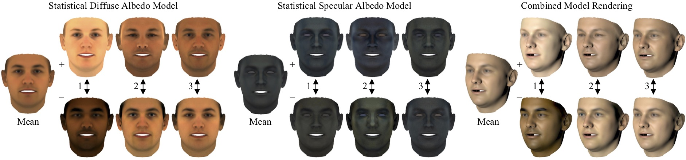
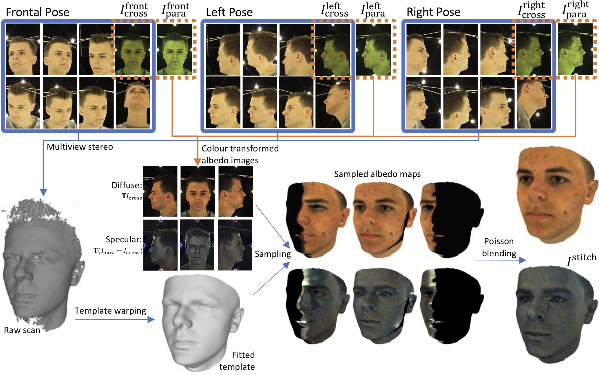

# [A Morphable Face Albedo Model](https://arxiv.org/)

 [William A. P. Smith](https://www-users.cs.york.ac.uk/wsmith)<sup> 1</sup>, [Alassane Seck](https://www.linkedin.com/in/alassane-seck-67508365)<sup> 2,3</sup>, [Hannah Dee](http://users.aber.ac.uk/hmd1/)<sup> 3</sup>, [Bernard Tiddeman](http://users.aber.ac.uk/bpt/)<sup> 3</sup>, [Joshua Tenenbaum](http://web.mit.edu/cocosci/josh.html)<sup> 4</sup> and [Bernhard Egger](https://eggerbernhard.ch/)<sup> 4</sup>
 <br/>
 <sup>1 </sup>University of York, UK
 <br/>
 <sup>2 </sup>ARM Ltd, UK
 <br/>
 <sup>3 </sup>Aberystwyth University, UK
 <br/>
 <sup>4 </sup>MIT, USA
 <br/>
#### [CVPR2020]

<br/>

<p align="center"></p>

## Abstract

In this paper, we bring together two divergent strands of research: photometric face capture and statistical 3D face appearance modelling. We propose a novel lightstage capture and processing pipeline for acquiring ear-to-ear, truly intrinsic diffuse and specular albedo maps that fully factor out the effects of illumination, camera and geometry. Using this pipeline, we capture a dataset of 50 scans and combine them with the only existing publicly available albedo dataset (3DRFE) of 23 scans. This allows us to build the first morphable face albedo model. We believe this is the first statistical analysis of the variability of facial specular albedo maps. This model can be used as a plug in replacement for the texture model of the Basel Face Model and we make our new albedo model publicly available. We ensure careful spectral calibration such that our model is built in a linear sRGB space, suitable for inverse rendering of images taken by typical cameras. We demonstrate our model in a state of the art analysis-by-synthesis 3DMM fitting pipeline, are the first to integrate specular map estimation and outperform the Basel Face Model in albedo reconstruction. 

## Scala code for loading, visualising and fitting the model
We make available [Scala code](scala/README.md) for loading the statistical model, visualising its principal components and fitting to an image in an inverse rendering pipeline. This code also enables to combine the albedo Model with the Basel Face Model to built a joint model file.

## Matlab code for sampling and Poisson blending textures
<p align="center"></p>
In our capture pipeline, we acquire three photometric views of the head and a mesh to which we fit template geometry. We have developed [Matlab code](matlab/README.md) for sampling and blending the different views into a seamless per-vertex texture. We also make available a matlab implementation of per-vertex ambient occlusion.

## Loading the model in Matlab

If you wish to use the model in matlab, download the h5 file in the release folder and use the following code:
```matlab
    texMU = h5read('albedoModel2020_bfm_albedoPart.h5','/diffuseAlbedo/model/mean')';
    texPC = h5read('albedoModel2020_bfm_albedoPart.h5','/diffuseAlbedo/model/pcaBasis')';
    texEV = h5read('albedoModel2020_bfm_albedoPart.h5','/diffuseAlbedo/model/pcaVariance')';
```

## Citation

If you use the model or the code in your research, please cite the following paper:

William A. P. Smith, Alassane Seck, Hannah Dee, Bernard Tiddeman, Joshua Tenenbaum and Bernhard Egger. "A Morphable Face Albedo Model". In Proc. of the IEEE Conference on Computer Vision and Pattern Recognition (CVPR), 2020.

Bibtex:

    @inproceedings{smith2020morphable,
      title={A Morphable Face Albedo Model},
      author={Smith, William A. P. and Seck, Alassane and Dee, Hannah and Tiddeman, Bernard and Tenenbaum, Joshua and Egger, Bernhard},
      booktitle={Proc. of the IEEE Conference on Computer Vision and Pattern Recognition (CVPR)},
      year={2020}
    }
    
In addition, if you use the model, you should cite the following paper since the model is partly derived from the data in the 3DRFE dataset:

Stratou, Giota, Abhijeet Ghosh, Paul Debevec, and Louis-Philippe Morency. "Effect of illumination on automatic expression recognition: a novel 3D relightable facial database." In Proc. Face and Gesture 2011, pp. 611-618. 2011.

Bibtex:

    @inproceedings{stratou2011effect,
      title={Effect of illumination on automatic expression recognition: a novel {3D} relightable facial database},
      author={Stratou, Giota and Ghosh, Abhijeet and Debevec, Paul and Morency, Louis-Philippe},
      booktitle=FG,
      pages={611--618},
      year={2011}
    }
